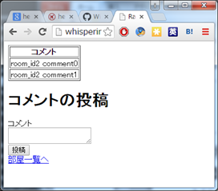

# railsComuTool
railsでコミュニケーションツール

<http://whispering-sea-7744.herokuapp.com/>

# バージョン履歴
## ver1.0.0
必要最小限のプログラム

* Roomsコントローラ、モデル、ビュー
	* 部屋名一覧の表示
	* 部屋作成フォーム
* RoomCommentsコントローラ、モデル、ビュー
	* 部屋名をクリックしてその中での会話を表示する
	* 発言フォーム

### データベースの設計
* 部屋テーブル(rooms)

|col_name|type|description|
|:----|:-----|:------|
|id|int|部屋ID|
|name|string|部屋名|

* 部屋内のコメントなどのテーブル(room_comments)

|col_name|type|description|
|:----|:--|:---|
|id|int|コメントID|
|rooms_id|int|部屋テーブルのID(FK)|
|comment|string|投稿されたコメント|

# 作成予定プログラム
## ver1.1.0
* レイアウトの変更(共通する部品の共有(ヘッダ、フッタ、メニュー))
* ログイン機能
* ユーザの表示
* 日付
* 削除機能(部屋、コメント、アカウント)

### データベースの設計
* 部屋テーブル(rooms)

|col_name|type|description|
|:----|:-----|:------|
|id|int|部屋ID|
|name|string|部屋名|
|last_comment_date|date|最終コメント投稿時間|

* 部屋内のコメントなどのテーブル(room_comments)

|col_name|type|description|
|:----|:--|:---|
|id|int|コメントID|
|rooms_id|int|部屋テーブルのID(FK)|
|user_id|string|ユーザアカウント管理テーブルのID(FK)|
|comment|string|投稿されたコメント|

* ユーザアカウント管理テーブル(users)

|col_name|type|description|
|:----|:--|:---|
|id|int|ユーザアカウント管理ID|
|name|string|ユーザ名|
|pass|string|パスワード(暗号化)|

|その他ユーザ情報|||

# メモ欄
## ほしい機能
* 指定のユーザが投稿したデータを抽出
* ユーザ一覧とそのユーザがアクティブかどうか
* ユーザ名なし（名無し）可能であるが，それぞれの名無しの識別ができる
* IPアドレスでユーザ名の識別
* クッキーでユーザ情報を判定
* セッションでアクティブかどうかの判定
	* 接続中のユーザを表示
* リアルタイムにコメントの反映
	* websocket? サーバから接続しているクライアントへpush通知
* ユーザ権限と管理者権限

## 画面設計
* index画面
  * 部屋一覧画面(左)
  * indexページ(右)
* 部屋名クリック後の画面
  * 部屋一覧(左側の画面)
  * 各部屋内部画面(右側の画面)
    * 各部屋内のコメント

## データベースの設計
* 部屋テーブル(rooms)

|col_name|type|description|
|:--------|:-----|:----------|
|id|int|部屋ID|
|name|string|部屋名|
|inpulse|double|勢い(過去一定時間内にコメントの数)|

* 部屋内のコメントなどのテーブル(roomComments)

|col_name|type|description|
|:--------|:-----|:----------|
|id|int|コメントID|
|rooms_id|int|部屋テーブルのID(FK)|
|user_id|int|ユーザのID(FK)|
|offset|int|投稿されたコメントの順番|
|comment|string|投稿されたコメント|

* ユーザテーブル

|col_name|type|description|
|:--------|:-----|:----------|
|id|int|ユーザID|
|user_name|string|ユーザ名(名無しユーザは”名無し+(識別子)”見たいな感じ)|
|active|boolean|そのユーザがアクティブかどうか|
|availableSpan||ユーザの有効期限(名無しユーザの数を減らすため)|
|その他ユーザ情報|||

アクティブユーザリストテーブル(名無しも識別)

|col_name|type|description|
|:--------|:-----|:----------|
|id|int|id|
|rooms_id|||
|user_id|||
|timeSpan||アクティブである有効期限|

# 開発環境
* Ruby 2.0.0p353 (2013-11-22)
* Rails 4.1.8
* DBMS 未定(SQLite or PostgrSQL or MySQL)
* web server 未定(webrick or Apache or nginx)

## その他開発環境、ツール
* windows 7
* sublime text3
* ConEmu, nyaos
* Git, GitHub, SourceTree, Git Flow
* Google Chrome

